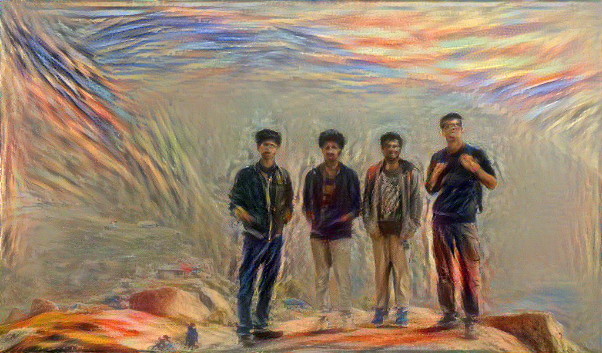

# Neural-Style-Transfer
<h2>What is Neural Style Transfer?</h2>
<h3>Neural style transfer is an optimization technique used to take two images—a content image and a style reference image (such as an artwork by a famous painter)—and blend them together so the output image looks like the content image, but “painted” in the style of the style reference image.</h3>

<h4>Some of my experiments </h4>

